# WEB SOLUTION WITH WORDPRESS

In this project you will be tasked to prepare storage infrastructure on two Linux servers and implement a basic web solution using WordPress. WordPress is a free and open-source content management system written in PHP and paired with MySQL or MariaDB as its backend Relational Database Management System (RDBMS).

## This Project consists of two parts:

1. Configure storage subsystem for Web and Database servers based on Linux OS. The focus of this part is to give you practical experience of working with disks, partitions and volumes in Linux.

2. Install WordPress and connect it to a remote MySQL database server. This part of the project will solidify your skills of deploying Web and DB tiers of Web solution.

## Three-tier Architecture

Generally, web, or mobile solutions are implemented based on what is called the Three-tier Architecture. Three-tier Architecture is a client-server software architecture pattern that comprise of 3 separate layers.

1. Presentation Layer (PL): This is the user interface such as the client server or browser on your laptop.

2. Business Layer (BL): This is the backend program that implements business logic. Application or Webserver

3. Data Access or Management Layer (DAL): This is the layer for computer data storage and data access. Database Server or File System Server such as FTP server, or NFS Server.

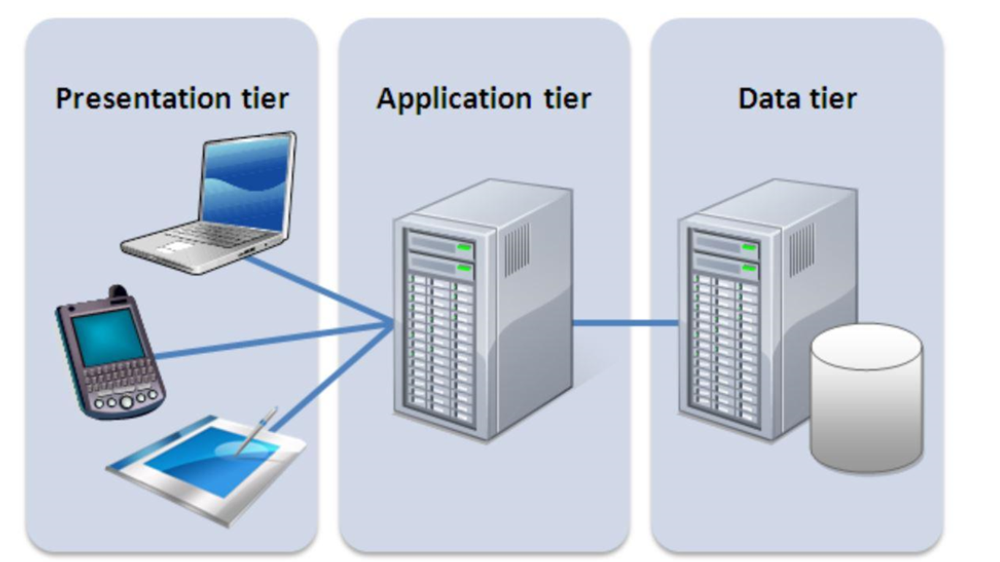

In this project, you will have the hands-on experience that showcases Three-tier Architecture while also ensuring that the disks used to store files on the Linux servers are adequately partitioned and managed through programs such as gdisk and LVM respectively.

You will be working working with several storage and disk management concepts, to have a better understanding, watch following video: Disk management in Linux

Note: We are gradually introducing new AWS elements into our solutions, but do not be worried if you do not fully understand AWS Cloud Services yet, there are Cloud focused projects ahead where we will get into deep details of various Cloud concepts and technologies – not only AWS, but other Cloud Service Providers as well.

## Your 3-Tier Setup

1. A Laptop or PC to serve as a client
2. An EC2 Linux Server as a web server (This is where you will install WordPress)
3. An EC2 Linux server as a database (DB) server.

In previous projects we used ‘Ubuntu’, but it is better to be well-versed with various Linux distributions, thus, for this projects we will use very popular distribution called ‘RedHat’ (it also has a fully compatible derivative – CentOS)

Note: for Ubuntu server, when connecting to it via SSH/Putty or any other tool, we used ubuntu user, but for RedHat you will need to use ec2-user user.

## LAUNCH AN EC2 INSTANCE THAT WILL SERVE AS “WEB SERVER”.

Step 1 — Prepare a Web Server

1. Launch an EC2 instance that will serve as "Web Server". Create 3 volumes in the same AZ as your Web Server EC2, each of 10 GiB.

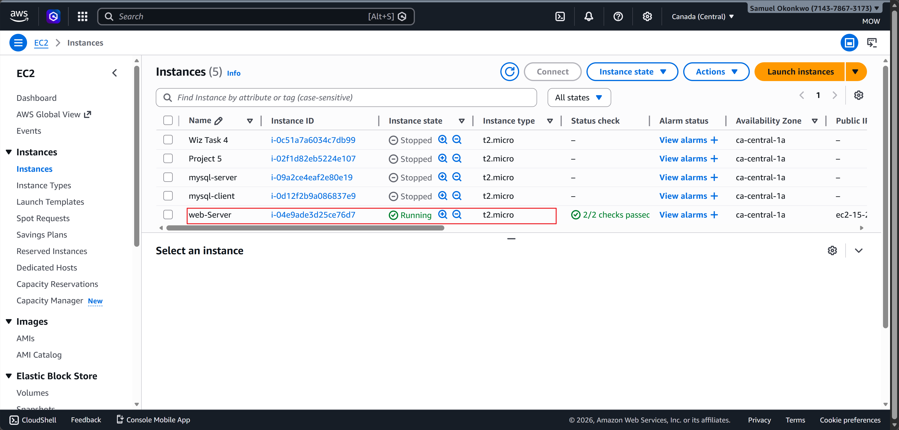

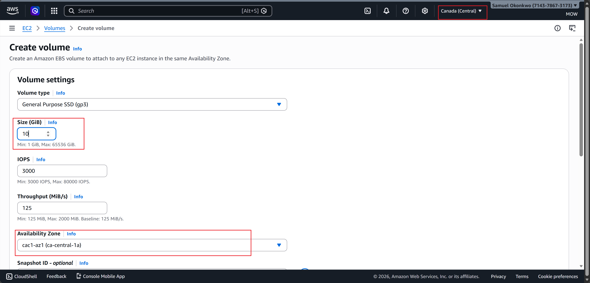

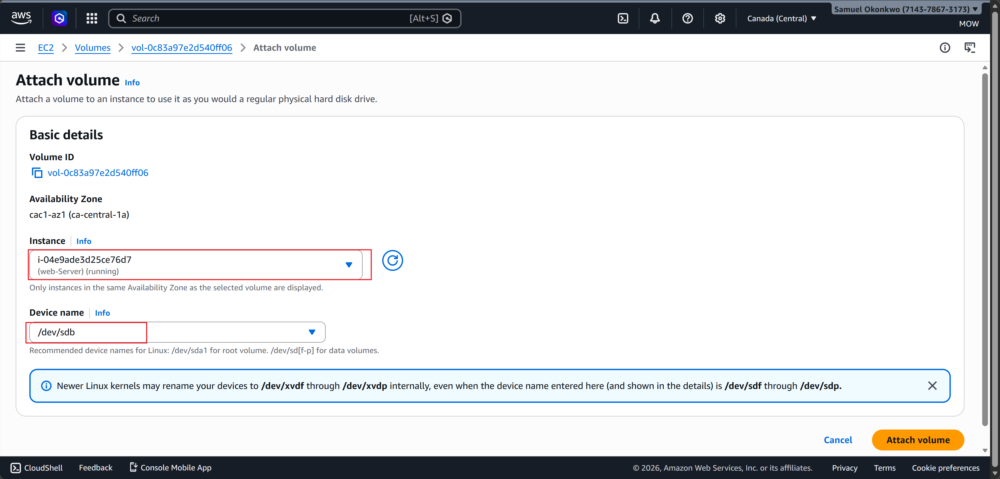

2. Open up the Linux terminal to begin configuration 

3. Use lsblk command to inspect what block devices are attached to the server. Notice names of your newly created devices. All devices in Linux reside in /dev/ directory. Inspect it with ls /dev/ and make sure you see all 3 newly created block devices there – their names will likely be xvdb, xvde, xvds.

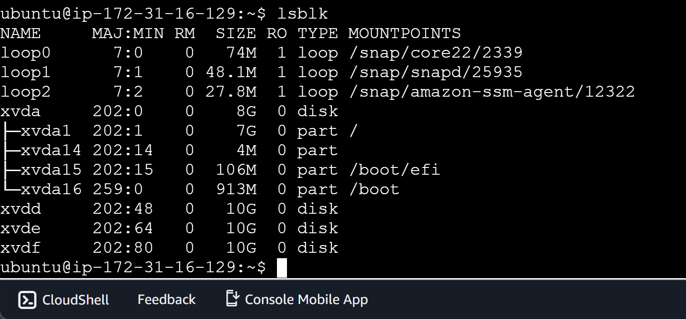

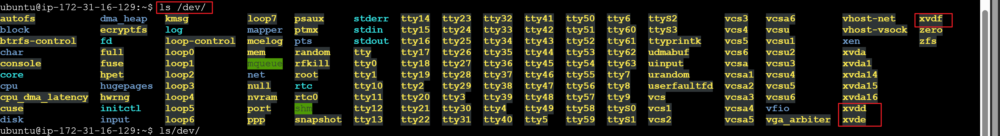

4. Use df -h command to see all mounts and free space on your server

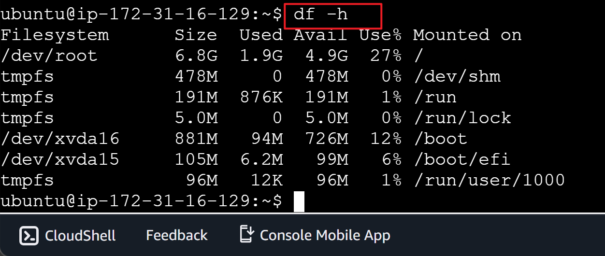

5. Use fdisk utility to create a single partition on each of the 3 disks 
sudo fdisk /dev/xvdb

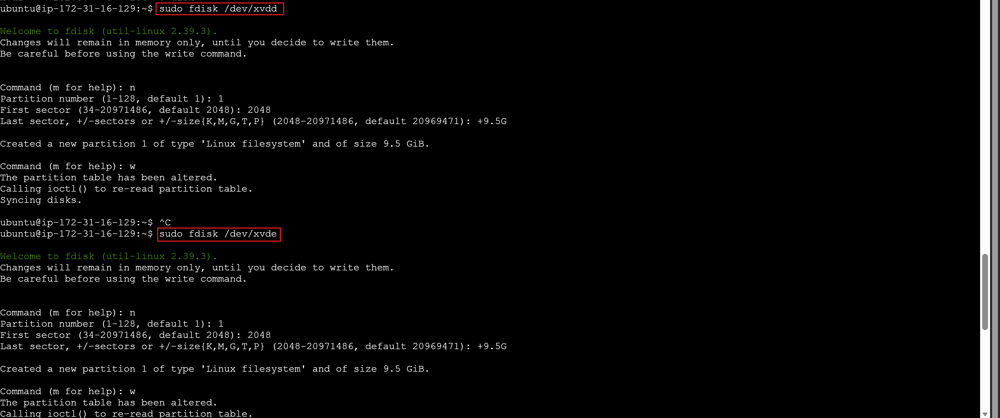

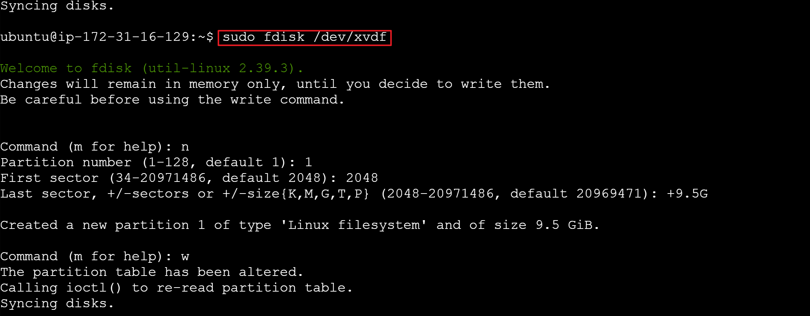

6. Use lsblk utility to view the newly configured partition on each of the 3 disks.

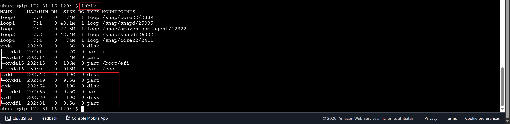

7. Install lvm2 package using 
sudo yum install lvm2. 
Run sudo lvmdiskscan command to check for available partitions.

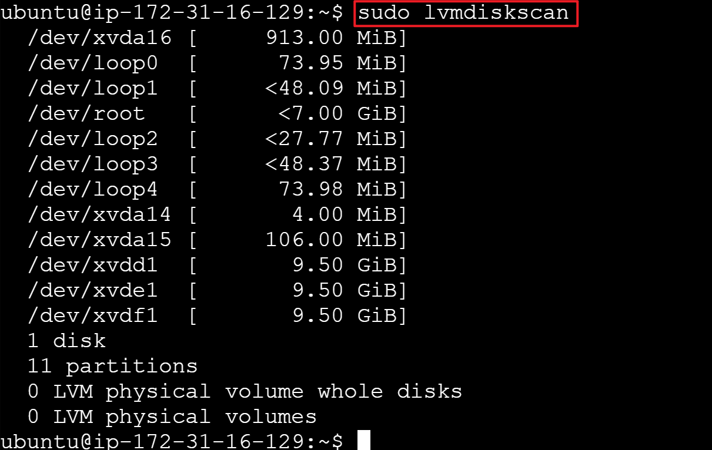

Note: Previously, in Ubuntu we used apt command to install packages, in RedHat/CentOS a different package manager is used, so we shall use yum command instead.

8. Use pvcreate utility to mark each of 3 disks as physical volumes (PVs) to be used by LVM
sudo pvcreate /dev/xvdd1
sudo pvcreate /dev/xvde1
sudo pvcreate /dev/xvdf1

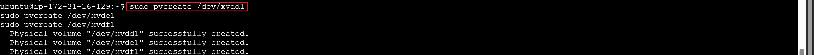

9. Verify that your Physical volume has been created successfully by running sudo pvs

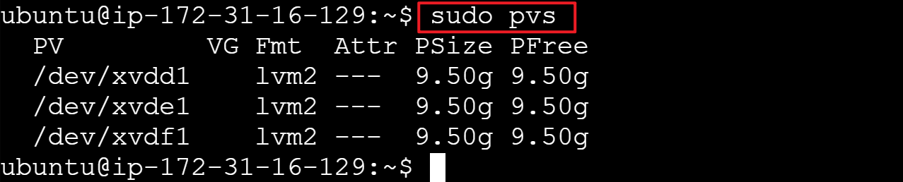

10. Use vgcreate utility to add all 3 PVs to a volume group (VG). Name the VG webdata-vg

sudo vgcreate webdata-vg /dev/xvdd1 /dev/xvde1 /dev/xvdf1

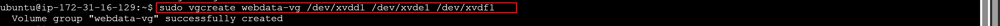

11. Verify that your VG has been created successfully by running sudo vgs

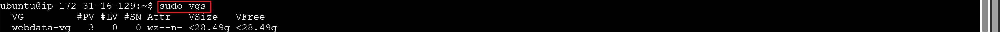

12. Use lvcreate utility to create 2 logical volumes. apps-lv (Use half of the PV size), and logs-lv Use the remaining space of the PV size. NOTE: apps-lv will be used to store data for the Website while, logs-lv will be used to store data for logs.
 
sudo lvcreate -n apps-lv -L 14G webdata-vg

sudo lvcreate -n logs-lv -L 14G webdata-vg

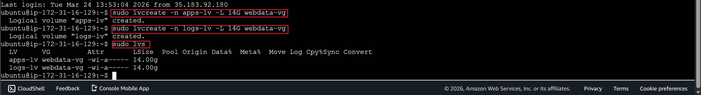

13. Verify the entire setup
 
sudo vgdisplay -v #view complete setup - VG, PV, and LV
sudo lsblk 

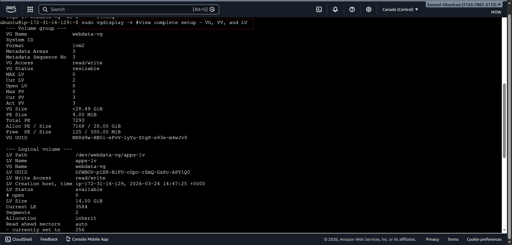

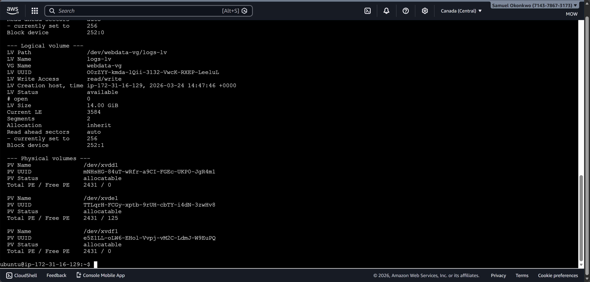

and run sudo lsblk

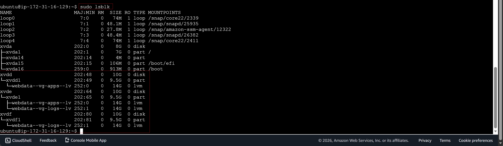

14. Use mkfs.ext4 to format the logical volumes with ext4 filesystem

sudo mkfs -t ext4 /dev/webdata-vg/apps-lv

sudo mkfs -t ext4 /dev/webdata-vg/logs-lv

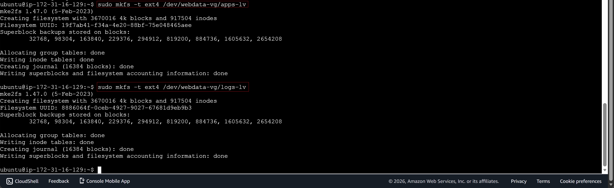

15. Create /var/www/html directory to store website files

sudo mkdir -p /var/www/html

16. Create /home/recovery/logs to store backup of log data
sudo mkdir -p /home/recovery/logs 

17. Mount /var/www/html on apps-lv logical volume

sudo mount /dev/webdata-vg/apps-lv /var/www/html/

18. Use rsync utility to back up all the files in the log directory /var/log into /home/recovery/logs (This is required before mounting the file system)

sudo rsync -av /var/log/. /home/recovery/logs/

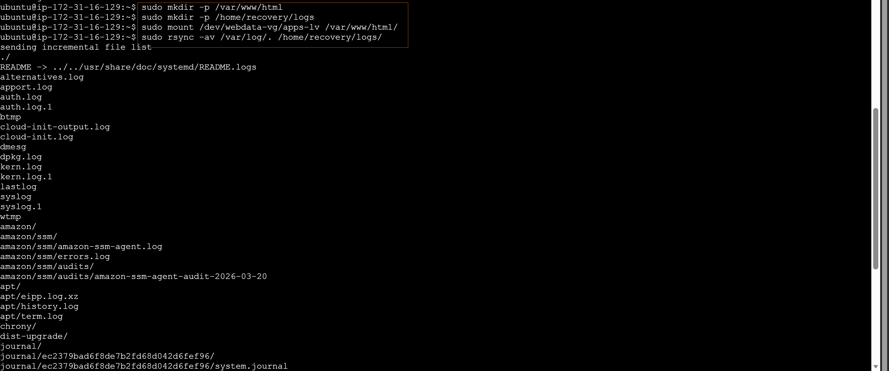

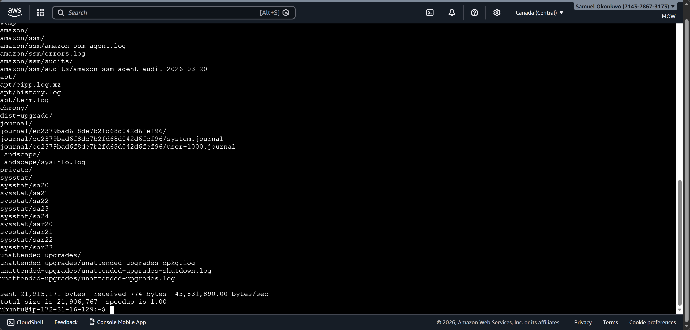

19. Mount /var/log on logs-lv logical volume. (Note that all the existing data on /var/log will be deleted. That is why step 15 above is very important) 

sudo mount /dev/webdata-vg/logs-lv /var/log

20. Restore log files back into /var/log directory

sudo rsync -av /home/recovery/logs/. /var/log

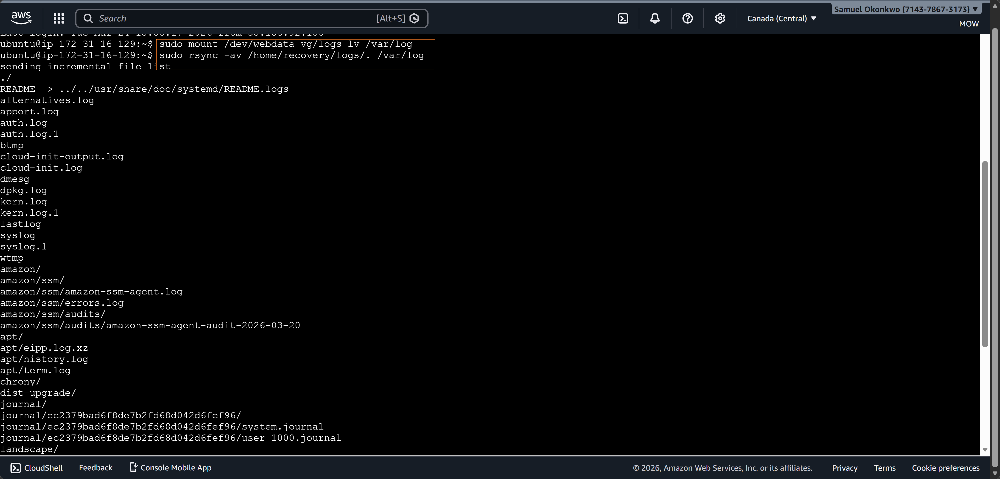

21. Update /etc/fstab file so that the mount configuration will persist after restart of the server.

# UPDATE THE /ETC/FSTAB FILE

The UUID of the device will be used to update the /etc/fstab file; sudo blkid

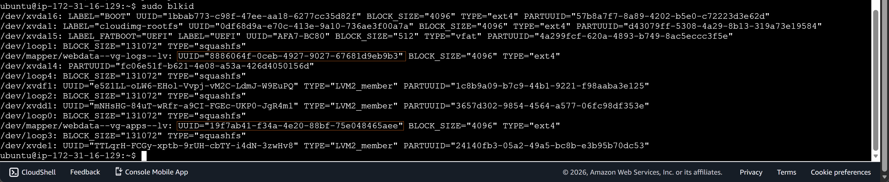

sudo vi /etc/fstab

Update /etc/fstab in this format using your own UUID and rememeber to remove the leading and ending quotes.

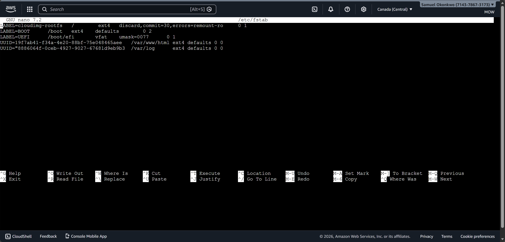

Test the configuration and reload the daemon

sudo mount -a

sudo systemctl daemon-reload

Verify your setup by running df -h, output must look like this:
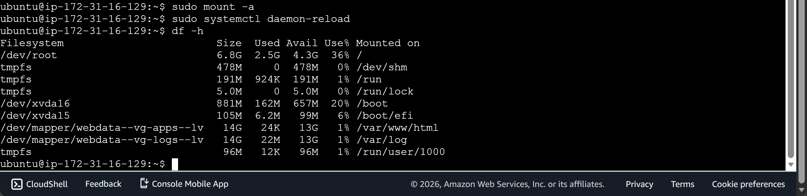

# Step 2 — Prepare the Database Server

Launch a second RedHat EC2 instance that will have a role – ‘DB Server’ Repeat the same steps as for the Web Server, but instead of apps-lv create db-lv and mount it to /db directory instead of /var/www/html/.

# Step 3 — Install WordPress on your Web Server EC2

Update the repository
 
sudo yum -y update

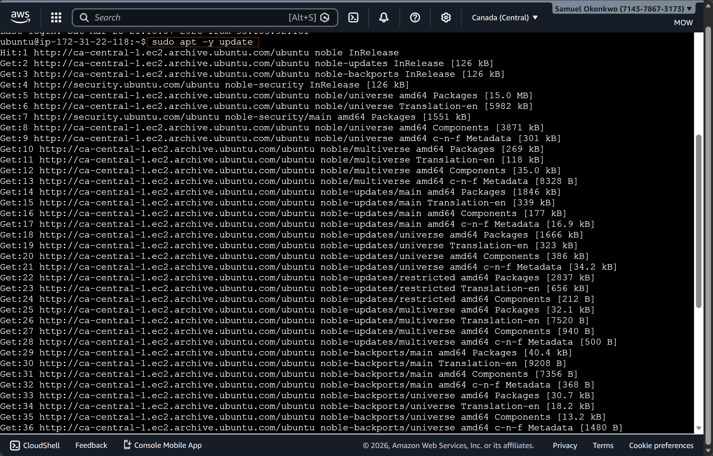

Install wget, Apache and it’s dependencies
 
sudo yum -y install wget httpd php php-mysqlnd php-fpm php-json

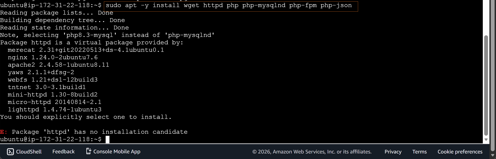

Start Apache

sudo systemctl enable httpd
sudo systemctl start httpd

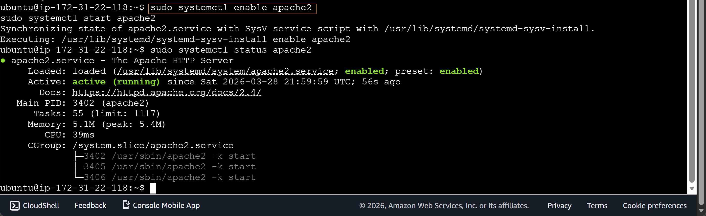

To install PHP and its depemdencies
 
sudo yum install https://dl.fedoraproject.org/pub/epel/epel-release-latest-8.noarch.rpm

sudo yum install yum-utils http://rpms.remirepo.net/enterprise/remi-release-8.rpm

sudo yum module list php

sudo yum module reset php

sudo yum module enable php:remi-7.4

sudo yum install php php-opcache php-gd php-curl php-mysqlnd

sudo systemctl start php-fpm

sudo systemctl enable php-fpm

setsebool -P httpd_execmem 1

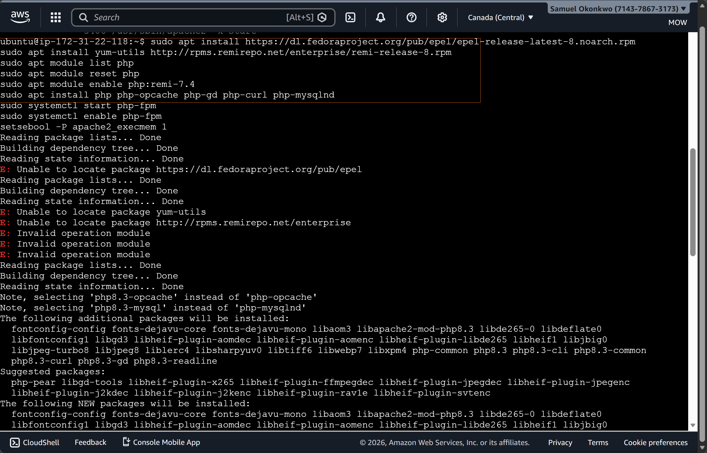

Restart Apache

sudo systemctl restart httpd

Download wordpress and copy wordpress to var/www/html
 
  mkdir wordpress
  cd   wordpress
  sudo wget http://wordpress.org/latest.tar.gz
  sudo tar xzvf latest.tar.gz
  sudo rm -rf latest.tar.gz
  cp wordpress/wp-config-sample.php wordpress/wp-config.php
  cp -R wordpress /var/www/html/

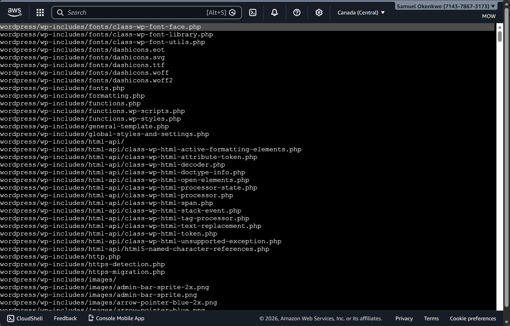

Configure SELinux Policies
 
  sudo chown -R apache:apache /var/www/html/wordpress
  sudo chcon -t httpd_sys_rw_content_t /var/www/html/wordpress -R
  sudo setsebool -P httpd_can_network_connect=1
	sudo setsebool -P httpd_can_network_connect_db 1

# Step 4 — Install MySQL on your DB Server EC2

sudo yum update

sudo yum install mysql-server

Verify that the service is up and running by using sudo systemctl status mysqld, if it is not running, restart the service and enable it so it will be running even after reboot:

sudo systemctl restart mysqld

sudo systemctl enable mysqld

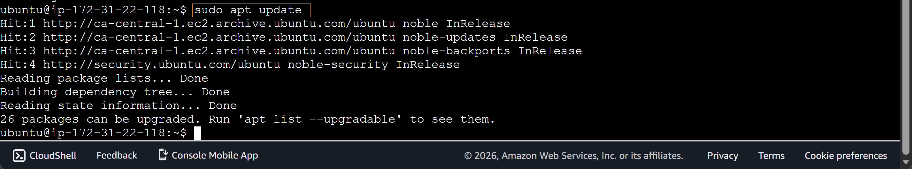

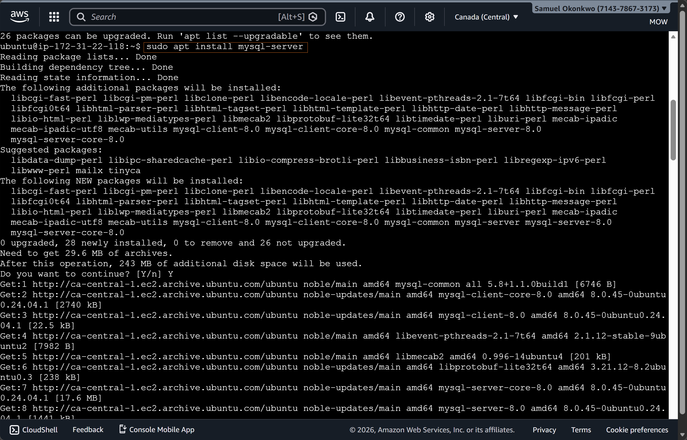

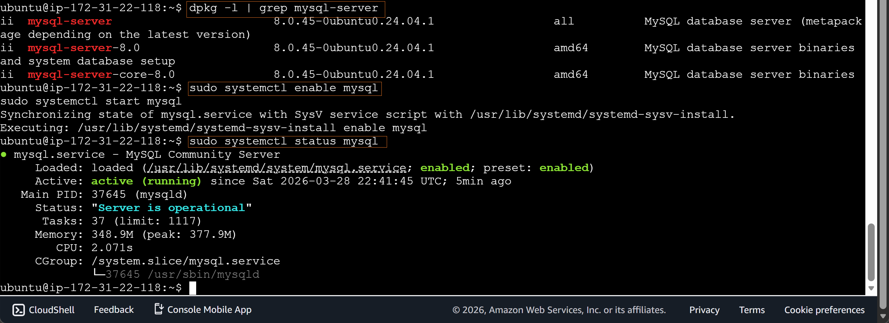

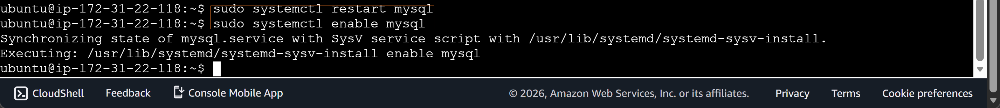

# Step 5 — Configure DB to work with WordPress

sudo mysql
CREATE DATABASE wordpress;
CREATE USER `myuser`@`<Web-Server-Private-IP-Address>` IDENTIFIED BY 'mypass';
GRANT ALL ON wordpress.* TO 'myuser'@'<Web-Server-Private-IP-Address>';
FLUSH PRIVILEGES;
SHOW DATABASES;
exit

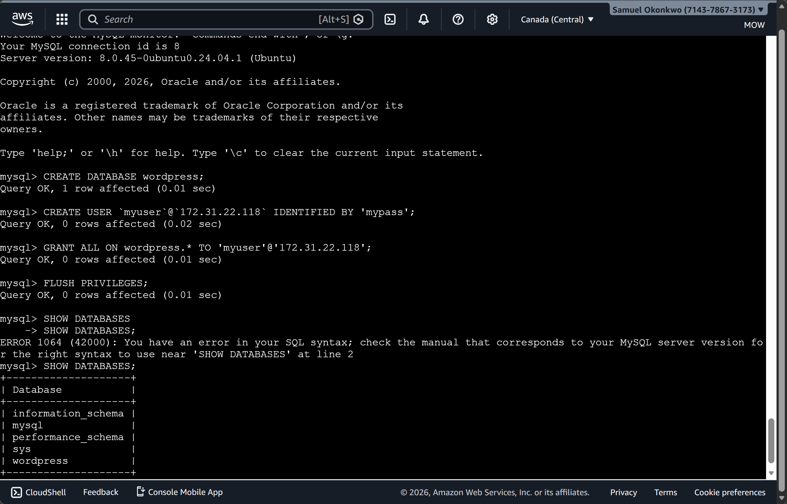

# Step 6 — Configure WordPress to connect to the remote database.

Hint: Do not forget to open MySQL port 3306 on DB Server EC2. For extra security, you shall allow access to the DB server ONLY from your Web Server’s IP address, so in the Inbound Rule configuration specify source as /32

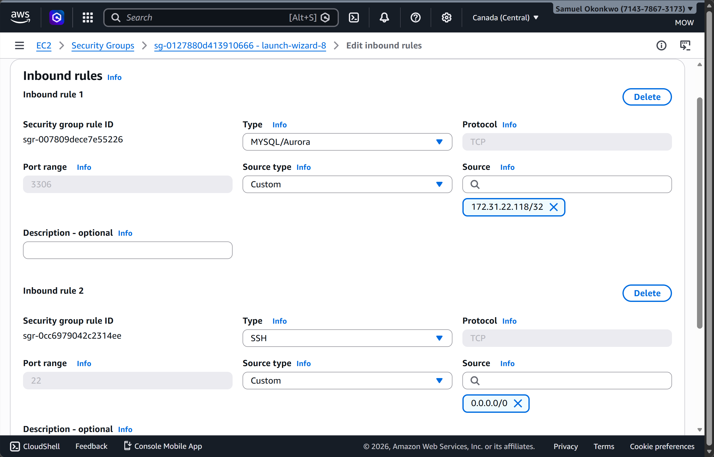

1. Install MySQL client and test that you can connect from your Web Server to your DB server by using mysql-client

sudo yum install mysql

sudo mysql -u admin -p -h <DB-Server-Private-IP-address>

2. Change permissions and configuration so Apache could use WordPress:

3. Enable TCP port 80 in Inbound Rules configuration for your Web Server EC2 (enable from everywhere 0.0.0.0/0 or from your workstation’s IP)

4. On the web server, edit wordpress configuration file.

cd /var/www/html/wordpress sudo vim wp-config.php

5. Disable the default page of apache so that you ca view the wordpress on the internet.
sudo mv /etc/httpd/conf.d/welcome.conf /etc/httpd/conf.d/welcome.conf_backup

Restart httpd. sudo systemctl restart httpd

sudo systemctl status httpd

6. Verify if you can successfully execute SHOW DATABASES; command and see a list of existing databases.
sudo mysql -u admin -p -h <DB-Server-Private-IP-address>

7. Change permissions and configuration so Apache could use WordPress:
sudo chown -R apache:apache /var/www/html/wordpress
sudo chcon -t httpd_sys_content_t /var/www/html/wordpress -R
sudo setsebool -P httpd_can_network_connect=1
sudo setsebool -P httpd_can_network_connect_db 1
8. Try to access from your browser the link to your WordPress http://<Web-Server-Public-IP-Address>/wordpress/

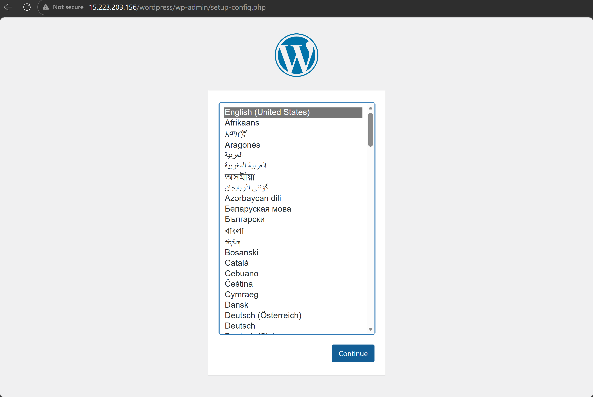

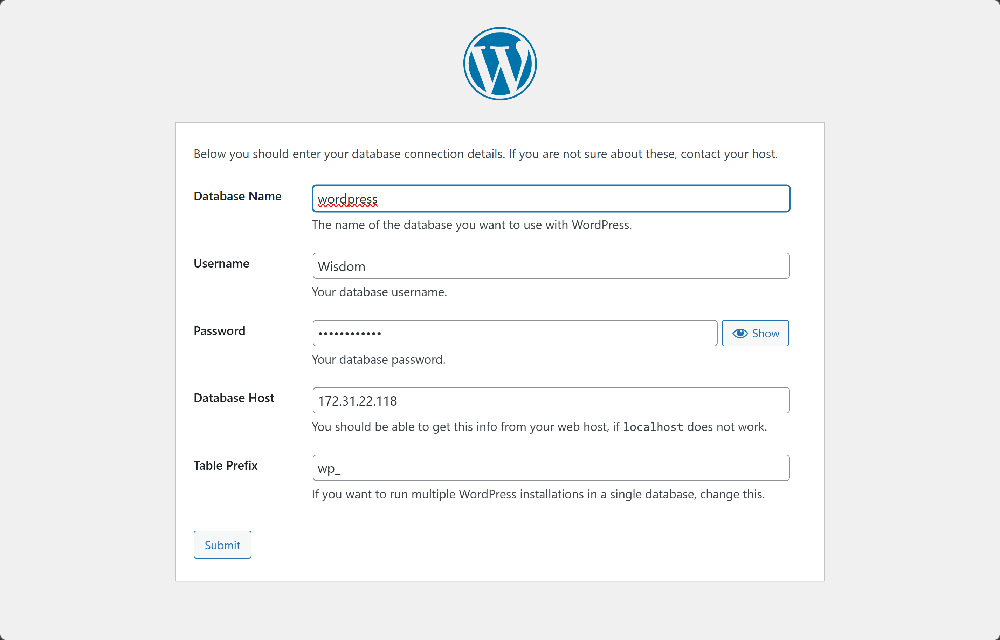

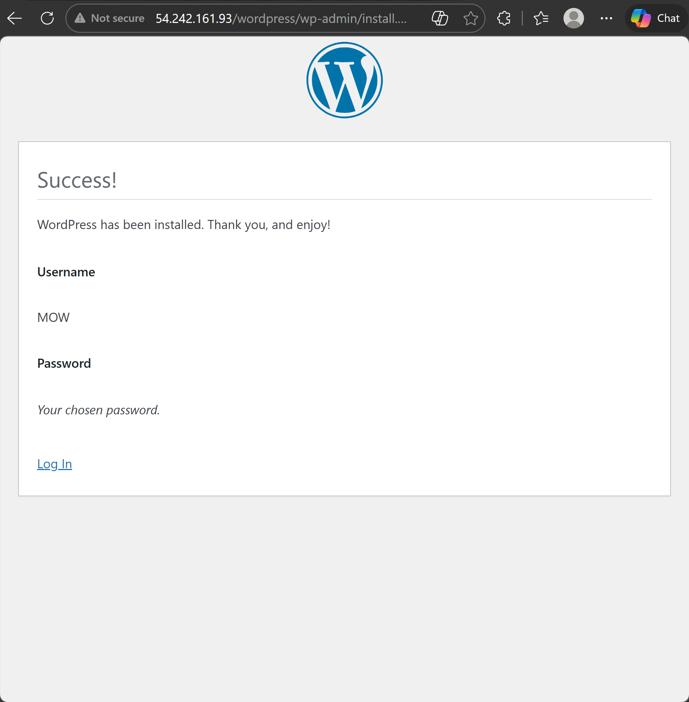

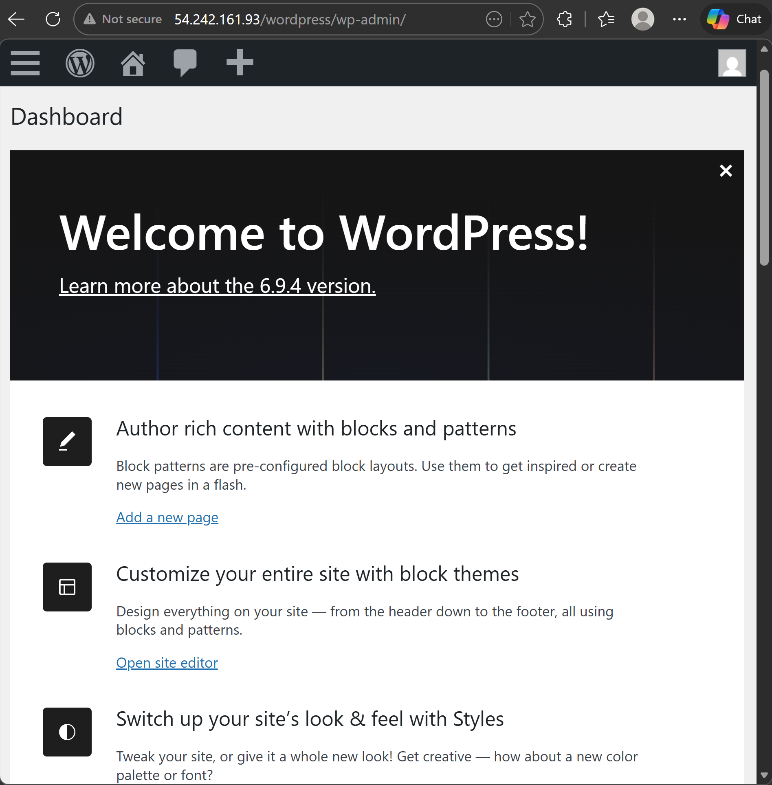