# Project 1: Web Stack Implementation (LAMP Stack) on AWS
## Project Overview

## Step-by-Step Implementation
### Step 0: Prerequisites
- Create an AWS account; i already have one

### Creating a virtual server with Ubuntu Server OS
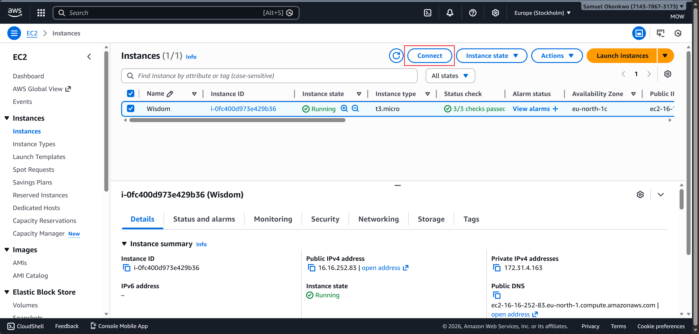

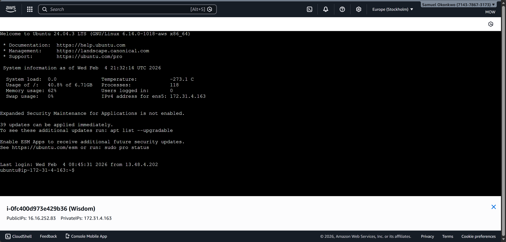

### Connecting the EC2 terminal

## Install Apache2 and update the firewall
 
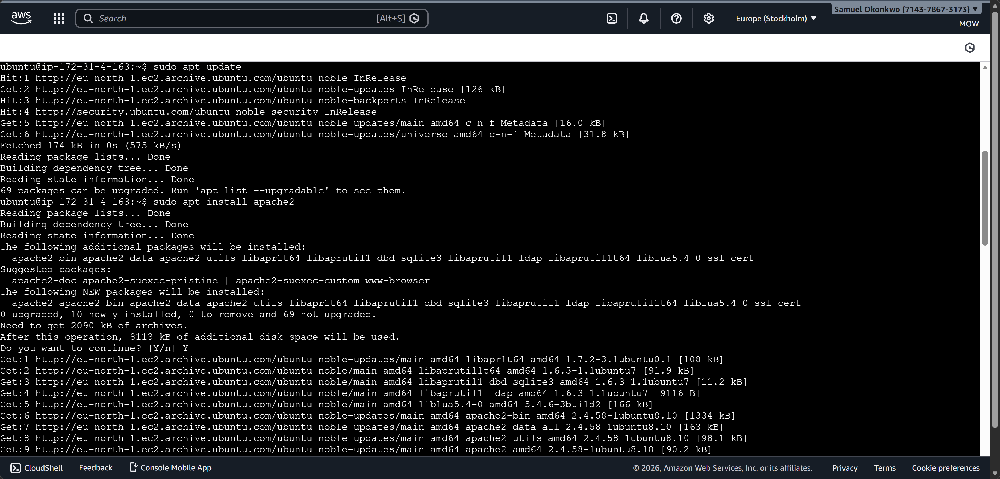 
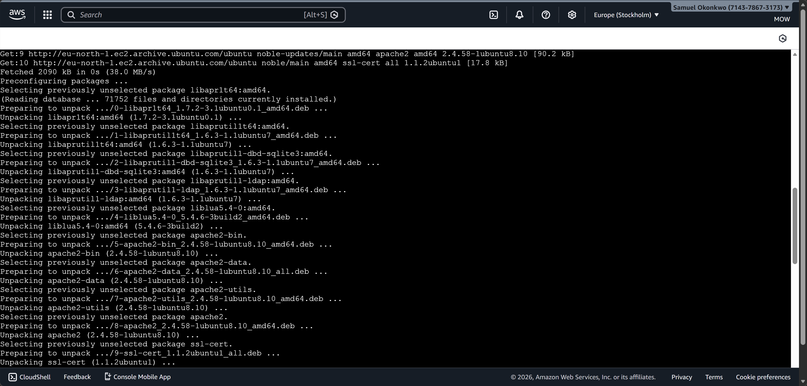 
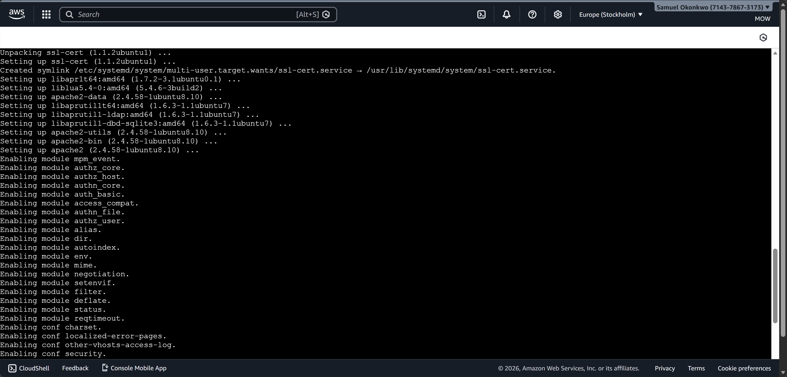

## Open inbound connection through port 80 by updating security groups

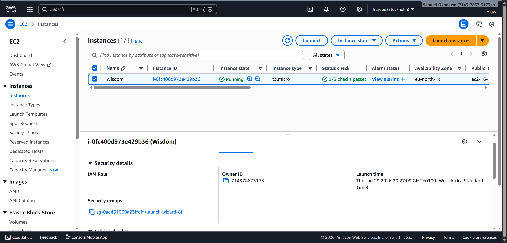 
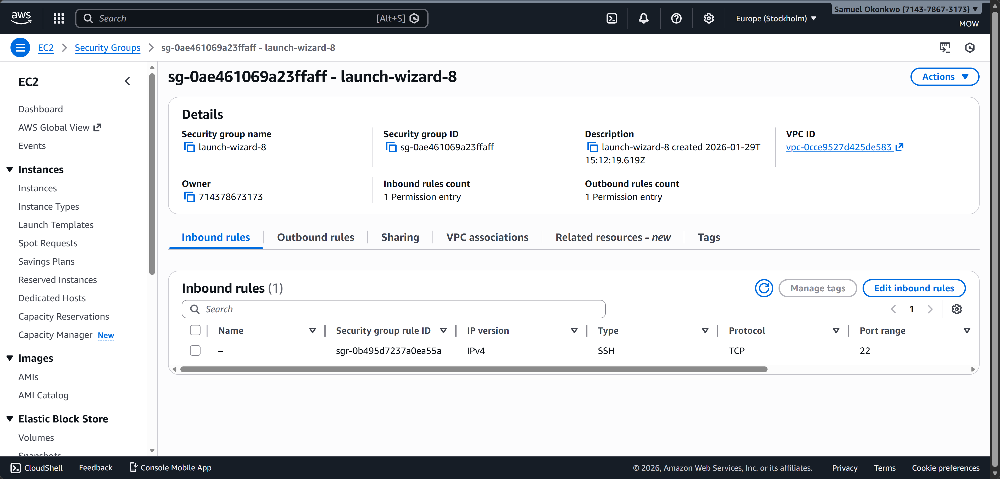 
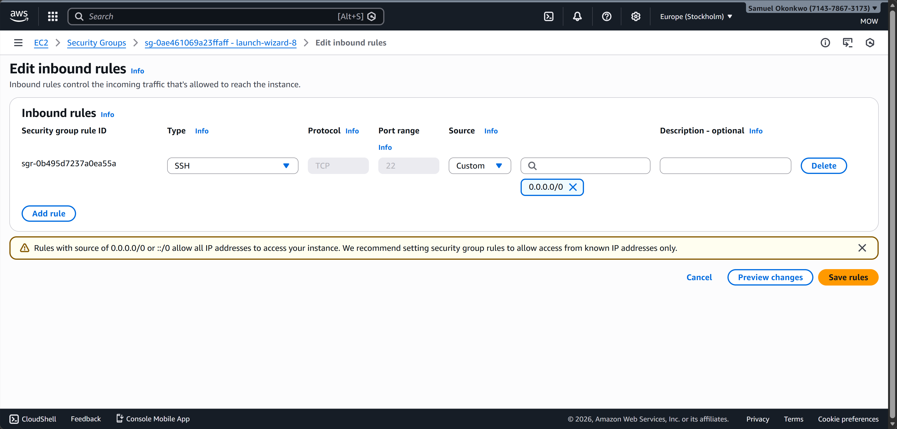 
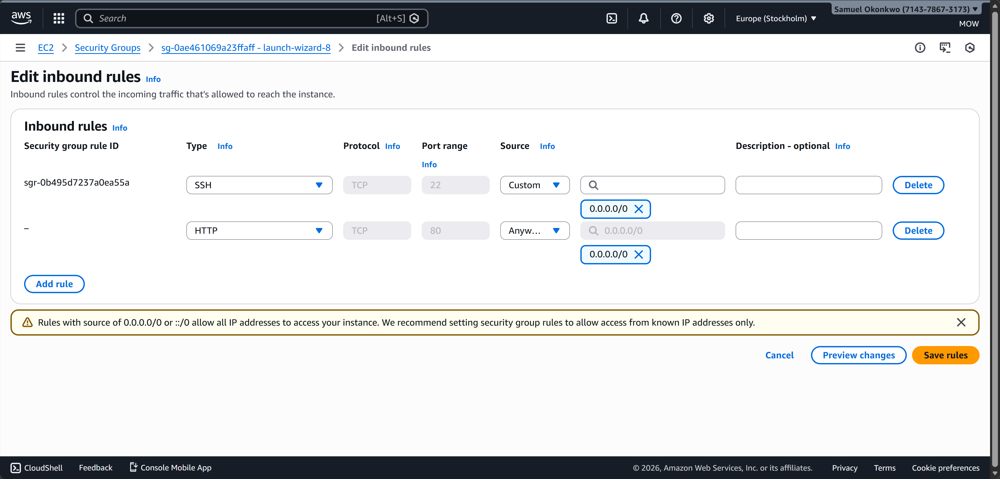 
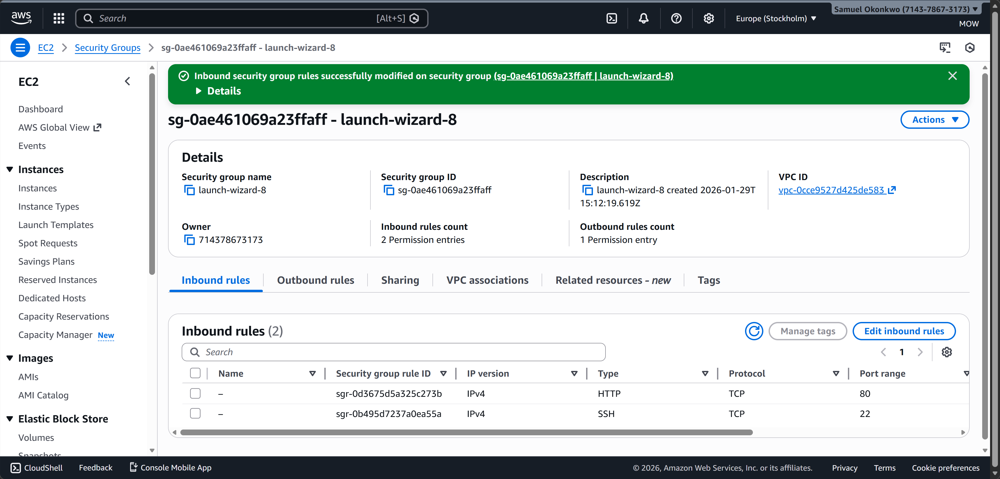

## To view the Apache default page, Go to http://Public-IP-Address:80 in your browser

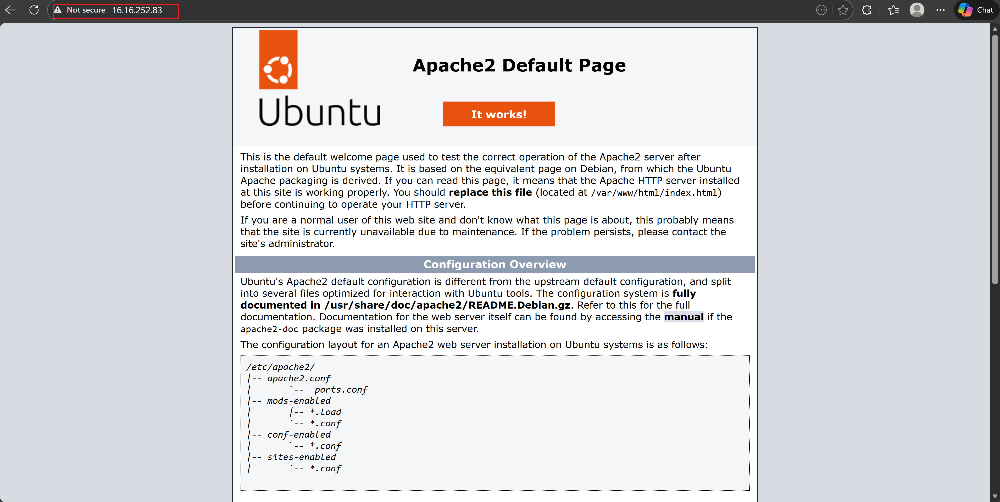

## Install MySQL
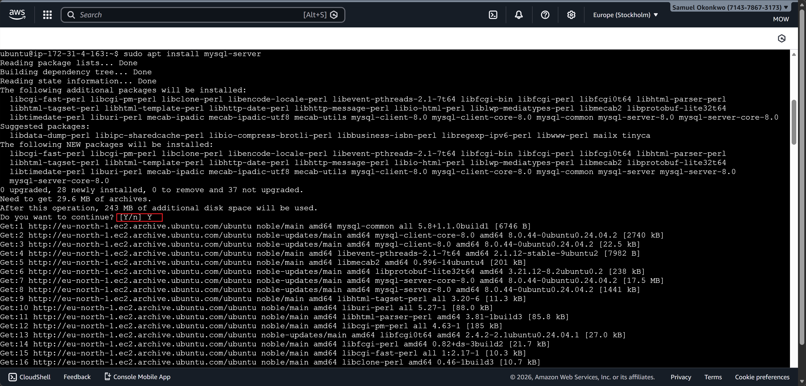 
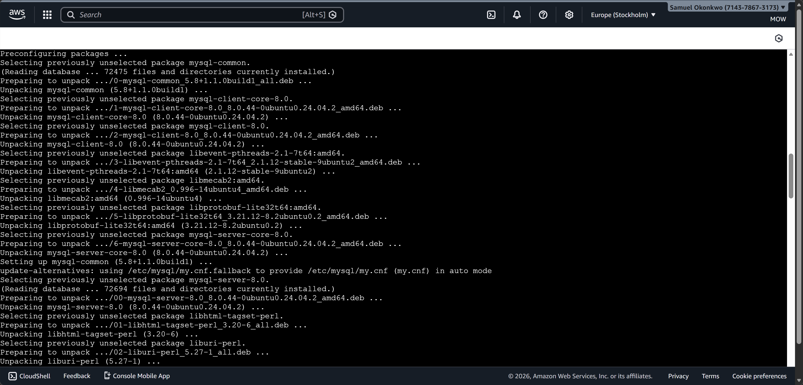 
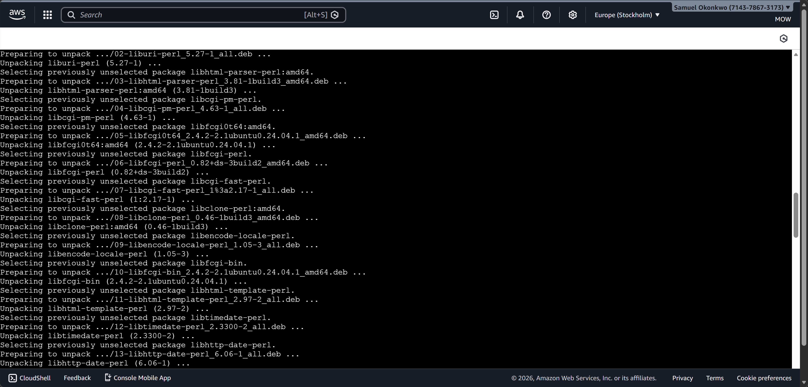 

## Logging into MySQL

## PHP installation
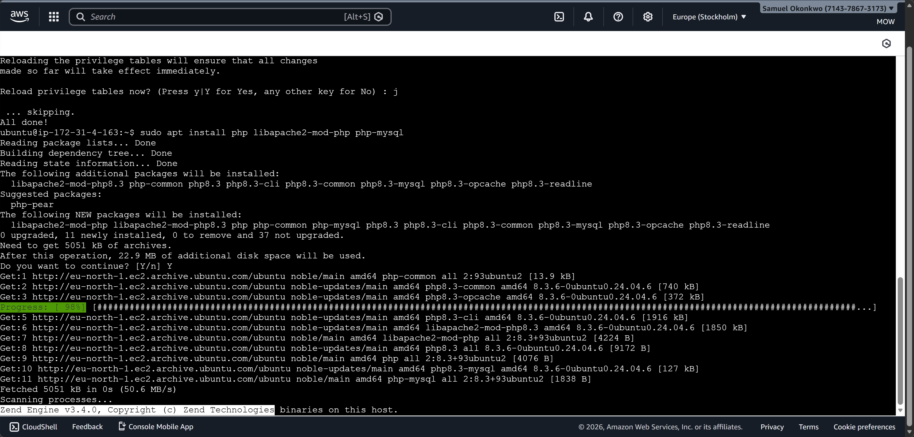

Once the installation is finished, you can run the following command to confirm your PHP version:
php -v
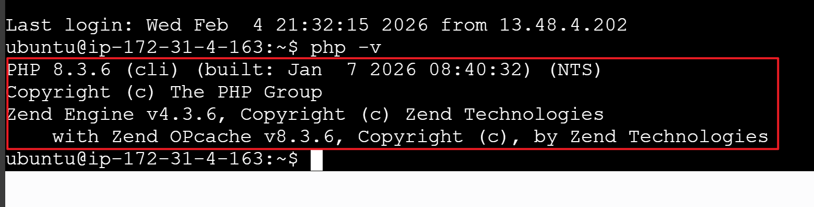

At this point, your LAMP stack is completely installed and fully operational.
- Linux (Ubuntu)
- Apache HTTP Server
- MySQL
- PHP

STEP 4 — CREATING A VIRTUAL HOST FOR YOUR WEBSITE USING APACHE
Create the directory for projectlamp using ‘mkdir’ command as follows:
sudo mkdir /var/www/projectlamp
Next, assign ownership of the directory with your current system user:
 sudo chown -R $USER:$USER /var/www/projectlamp
Then, create and open a new configuration file in Apache’s sites-available directory using your preferred command-line editor.
sudo vi /etc/apache2/sites-available/projectlamp.conf

Now go to your browser and try to open your website URL using IP address:
http://16.16.252.83:80

## ENABLE PHP ON THE WEBSITE
Change the default directory setting on Apache from index.html to index.php:
sudo vim /etc/apache2/mods-enabled/dir.conf

Create a new file named index.php inside your custom web root folder using:
vim /var/www/projectlamp/index.php

When you are finished, save and close the file, refresh the page and you will see:

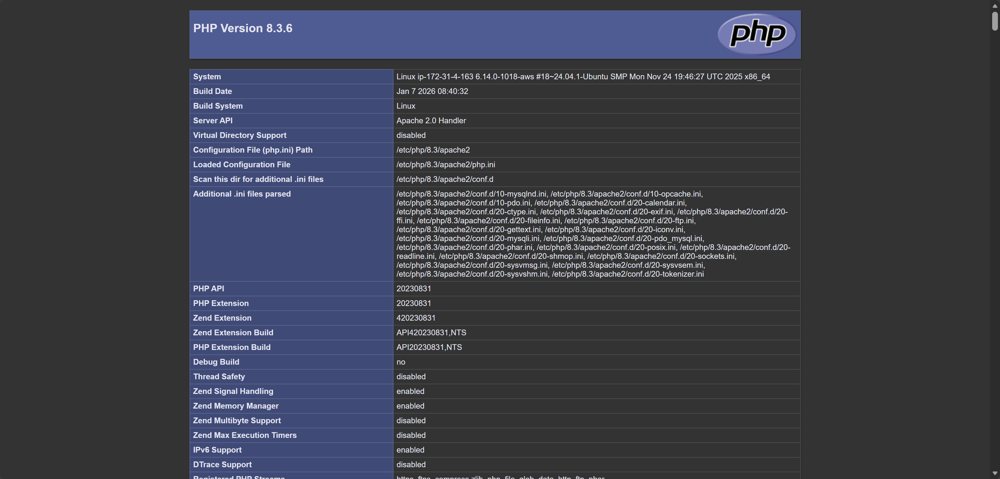

