# Step 1 – Install Nginx
Nginx is a high‑performance web server that will serve your site’s files to visitors. It’s known for handling large numbers of concurrent connections efficiently, making it ideal for modern web applications.

Start by updating your package list to ensure you’re installing the latest version available in Ubuntu’s repositories:

sudo apt update
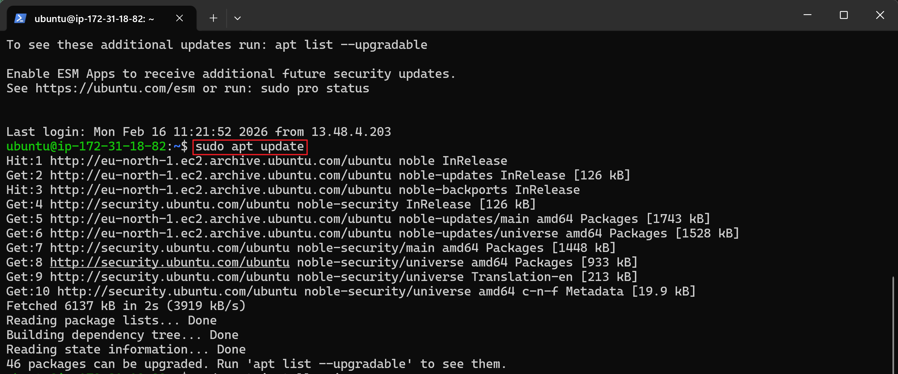

sudo apt install nginx
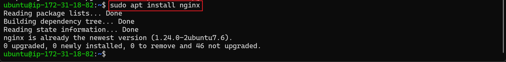

Once installed, check that Nginx is running as a service:
sudo systemctl status nginx
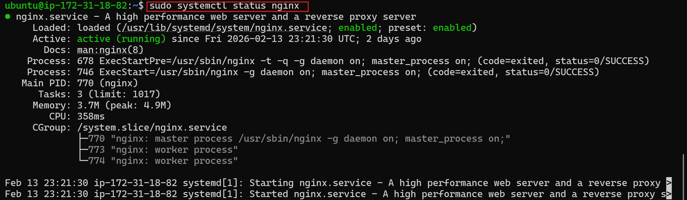

If successful, you’ll see it listed as “active (running).”

You can test locally with:
http://16.170.98.180:80
This sends a request directly to the server. Then open the same URL in a browser to confirm it’s accessible externally. If you see the default Nginx welcome page, your web server is working.
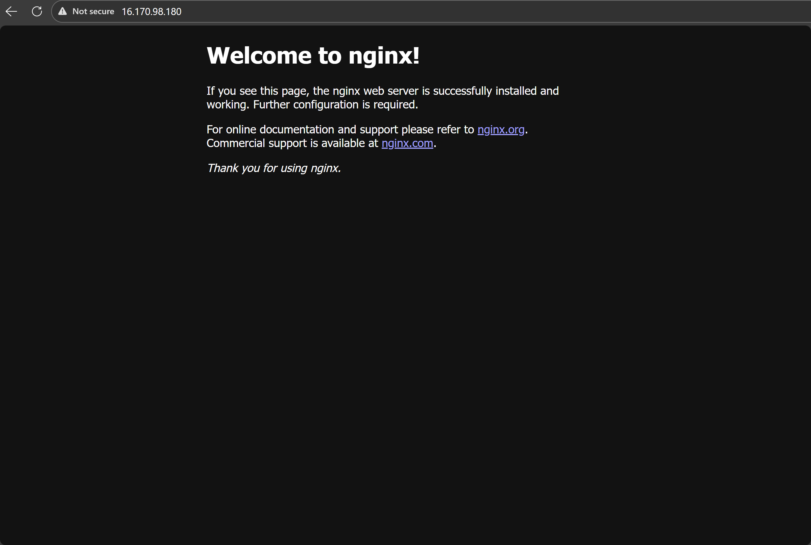

# Step 2 – Install MySQL
MySQL is the database system that stores and manages your site’s data. It allows you to organize information in tables and query it efficiently.

Install MySQL with:
sudo apt install mysql-server
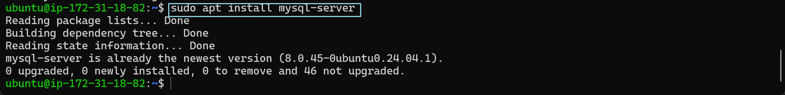

Log in to the console:
sudo mysql
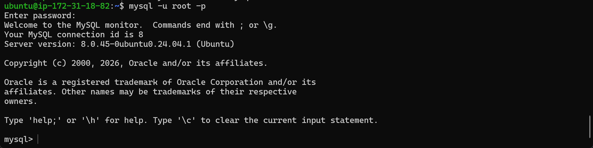

# Step 3 – Install PHP
PHP is the scripting language that generates dynamic content and communicates with MySQL. Nginx doesn’t process PHP directly, so we install PHP‑FPM (FastCGI Process Manager), which acts as the bridge.

Install PHP and the MySQL extension:
sudo apt install php-fpm php-mysql
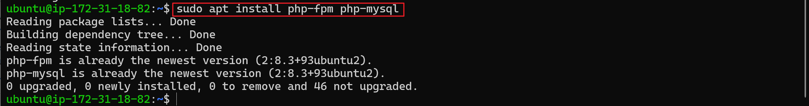
This ensures PHP can run scripts and connect to your database.

# Step 4 – Configure Nginx for PHP
By default, Nginx serves static files. To handle PHP, you need to configure it to pass .php requests to PHP‑FPM.

Create a project directory for your site:
sudo mkdir /var/www/projectLEMP
sudo chown -R $USER:$USER /var/www/projectLEMP
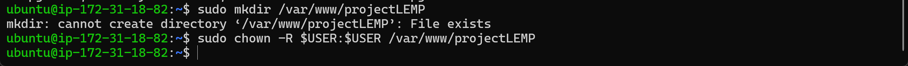

This is where your site’s files will live.

Create a new server block (virtual host):
sudo nano /etc/nginx/sites-available/projectLEMP
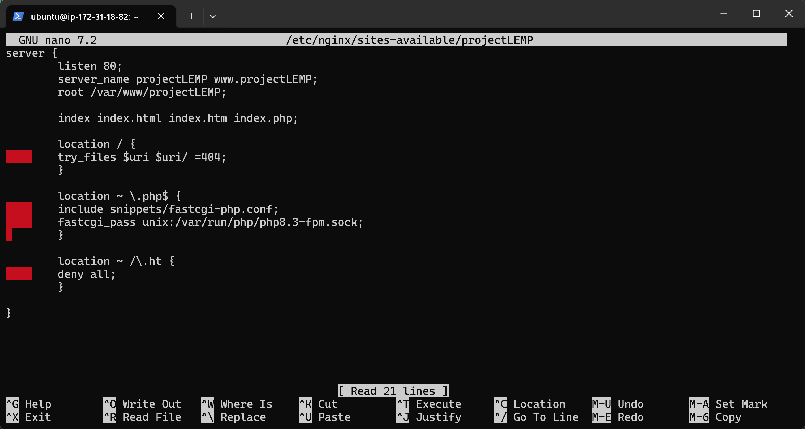
This file defines how Nginx should serve your site.

Enable it and disable the default block:
sudo ln -s /etc/nginx/sites-available/projectLEMP /etc/nginx/sites-enabled/
sudo nginx -t
sudo unlink /etc/nginx/sites-enabled/default
sudo systemctl reload nginx
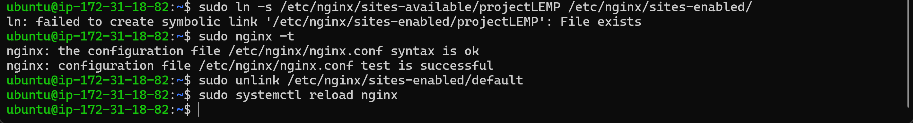

This tells Nginx to use your custom configuration.

Add a simple HTML file to test:
echo 'Hello LEMP' > /var/www/projectLEMP/index.html
Visiting your server IP should now display this message, confirming your configuration works.
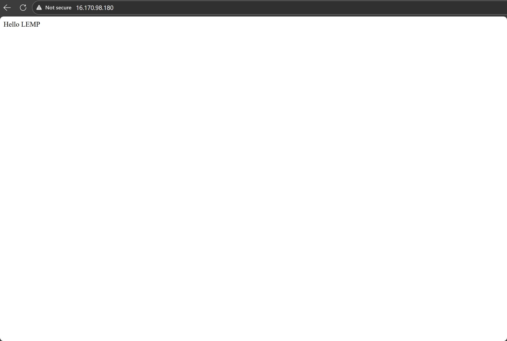

# Step 5 – Test PHP
To confirm PHP is integrated correctly, create a PHP info file:
sudo nano /var/www/projectLEMP/info.php
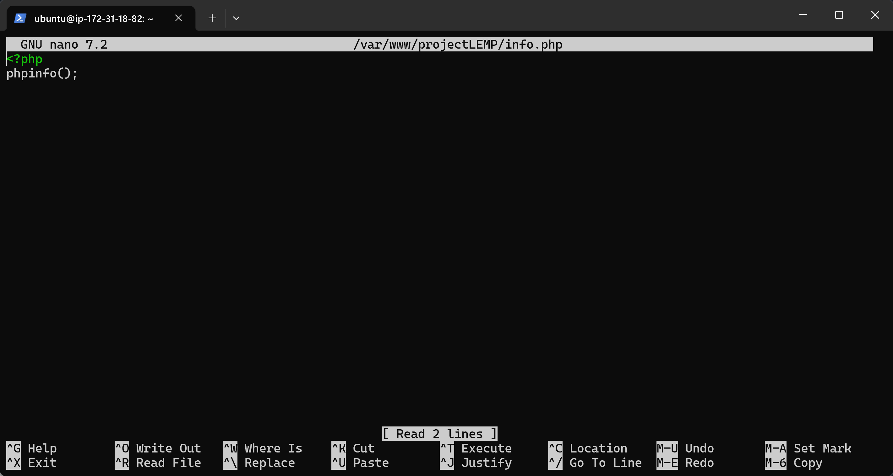

Visit http://16.170.98.180/info.php in your browser. If you see a detailed PHP information page, Nginx is successfully passing PHP requests to PHP‑FPM.
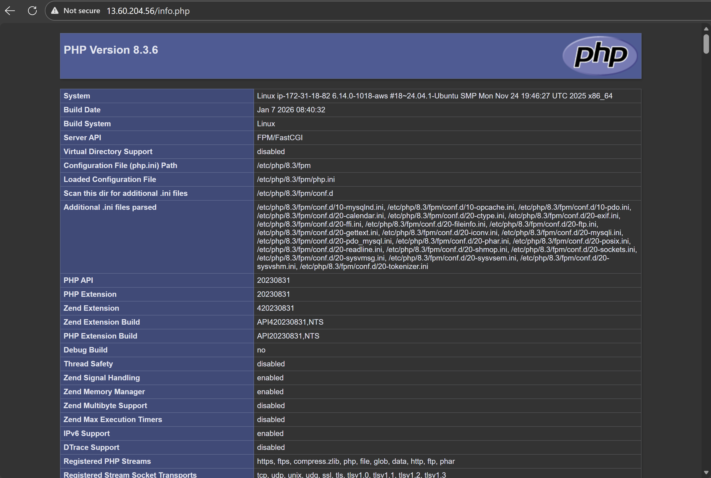

# Step 6 – MySQL + PHP Integration
Now let’s connect PHP to MySQL.

Create a database and user:
CREATE DATABASE example_database;
CREATE USER 'example_user'@'%' IDENTIFIED WITH mysql_native_password BY 'password';
GRANT ALL ON example_database.* TO 'example_user'@'%';
If you can log in, the user has been created successfully.

Create a table and insert data:
CREATE TABLE example_database.todo_list (
  item_id INT AUTO_INCREMENT,
  content VARCHAR(255),
  PRIMARY KEY(item_id)
);
INSERT INTO example_database.todo_list (content) VALUES ("My first item");
SELECT * FROM example_database.todo_list;

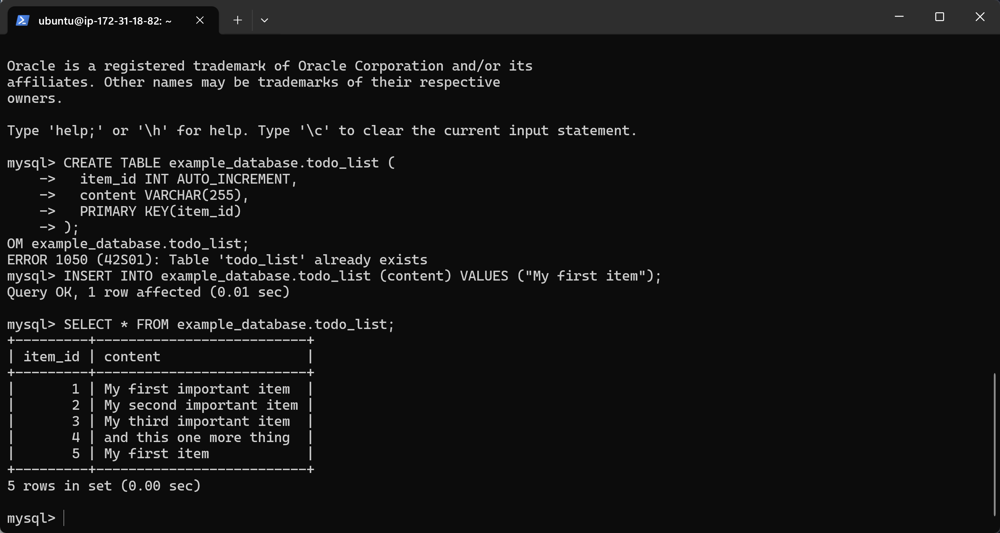
This creates a simple table and adds a test row.

Finally, create a PHP script to query the database:
nano /var/www/projectLEMP/todo_list.php
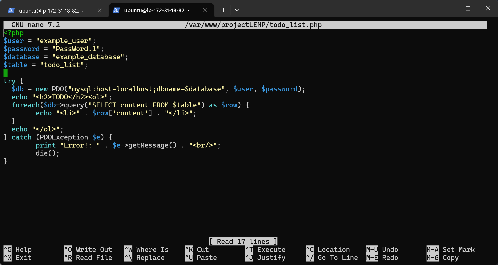

Visit http://16.170.98.180/todo_list.php to see your database content displayed on the web. This confirms PHP can connect to MySQL and retrieve data.

With this setup, you now have a fully functioning LEMP stack: Nginx serving web pages, PHP generating dynamic content, and MySQL storing your data.
