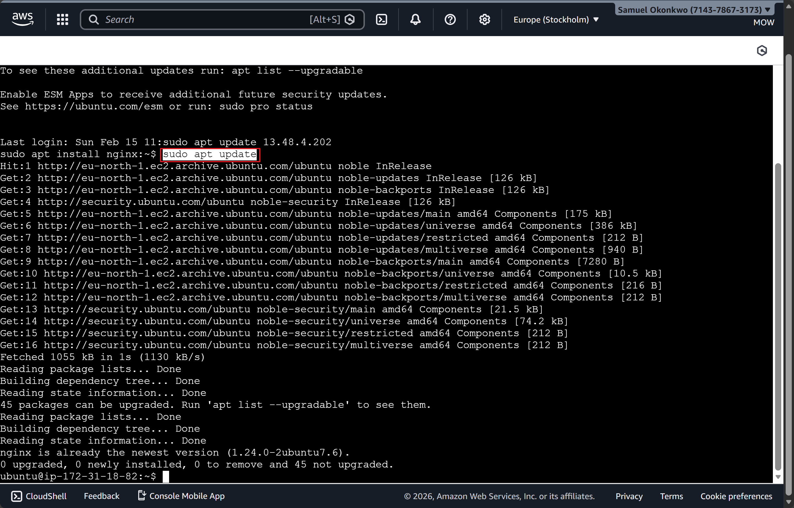

# Step 1 – Install Nginx
Nginx is a high‑performance web server that will serve your site’s files to visitors. It’s known for handling large numbers of concurrent connections efficiently, making it ideal for modern web applications.

Start by updating your package list to ensure you’re installing the latest version available in Ubuntu’s repositories:

sudo apt update
sudo apt install nginx
