# IMPLEMENTATION OF A CLIENT SERVER ARCHITECTURE USING MYSQL DATABASE MANAGEMENT SYSTEM (DBMS).
## CLIENT-SERVER ARCHITECTURE WITH MYSQL

Client-Server refers to an architecture in which two or more computers are connected together over a network to send and receive requests between one another. In their communication, each machine has its own role: the machine sending requests is usually referred as "Client" and the machine responding (serving) is called "Server". A simple diagram of Web Client-Server architecture is presented below:

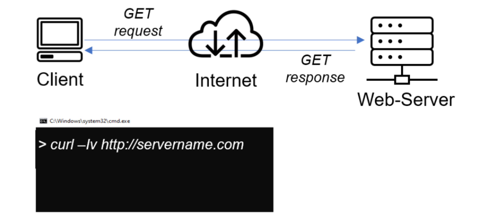

In the example above, a machine that is trying to access a Web site using a Web browser or simply ‘curl’ command is a client and it sends HTTP requests to a Web server (Apache, Nginx, IIS or any other) over the Internet. If we extend this concept further and add a Database Server to our architecture, we can get this picture:

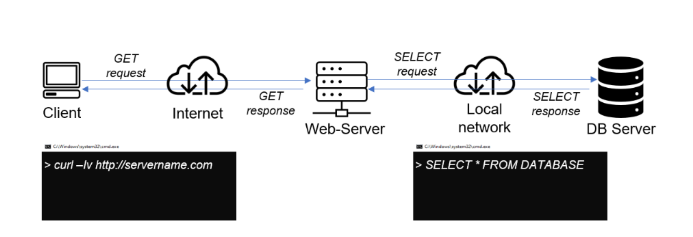

The Web Server has a role of a "Client" that connects and reads/writes to/from a Database (DB) Server (MySQL, MongoDB, Oracle, SQL Server or any other), and the communication between them happens over a Local Network (it can also be an Internet connection, but it is a common practice to place Web Server and DB Server close to each other in a local network).
Essentially, it is sending requests to the remote server, and in turn, would be expecting some kind of response from the remote server. Let’s take a very quick example and see Client-Server communicatation in action. Open up your Ubuntu or Windows terminal and run the curl command:

curl -Iv www.bing.com

Note: If your Ubuntu does not have ‘curl’, you can install it by running sudo apt install curl In this example, your terminal will be the client, while www.bing.com will be the server.

See the response from the remote server in the below output. You can also see that the requests from the URL are being served by a computer with an IP address 204.79.197.200 on port 80.

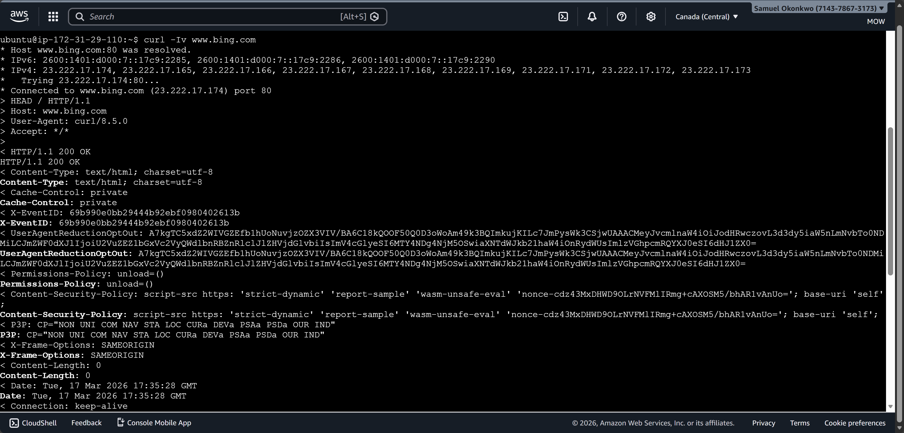

## TO DEMONSTRATE A BASIC CLIENT-SERVER USING MYSQL RELATIONAL DATABASE MANAGEMENT SYSTEM (RDBMS), FOLLOW THE BELOW INSTRUCTIONS:

1. Create and configure two Linux-based virtual servers (EC2 instances in AWS).
Server A name - mysql-server and Server B name - mysql-client

On mysql-server Linux Server install MySQL Server software.

sudo apt update

Then install the mysql-server package:

sudo apt install mysql-server

Ensure that the server is running using the systemctl command:

sudo systemctl start mysql.service

sudo systemctl status mysql.service

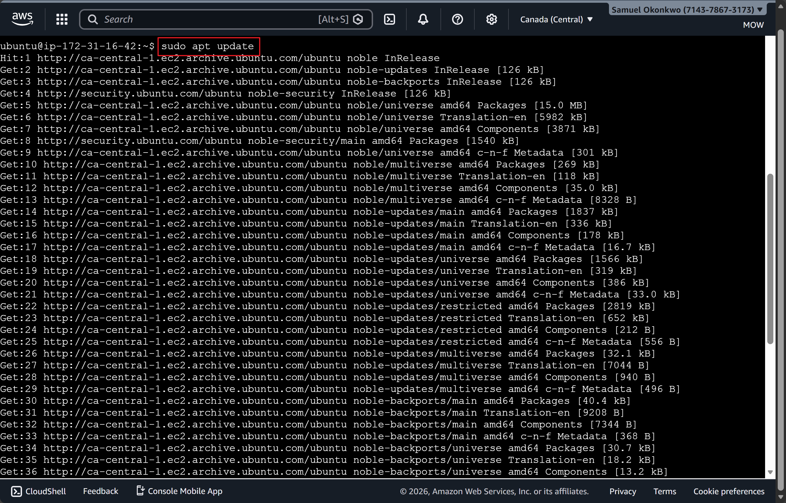

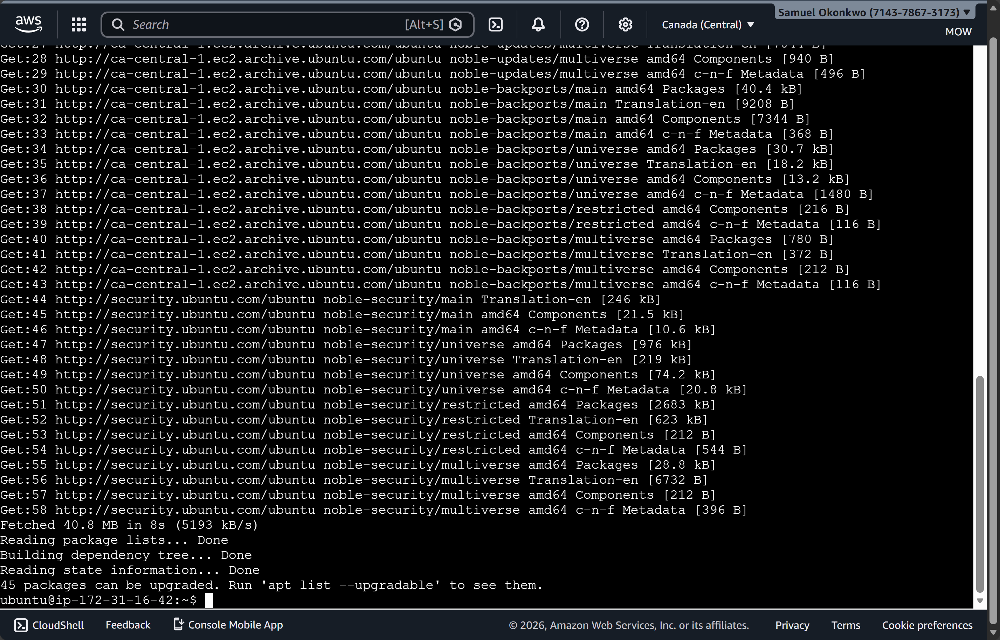

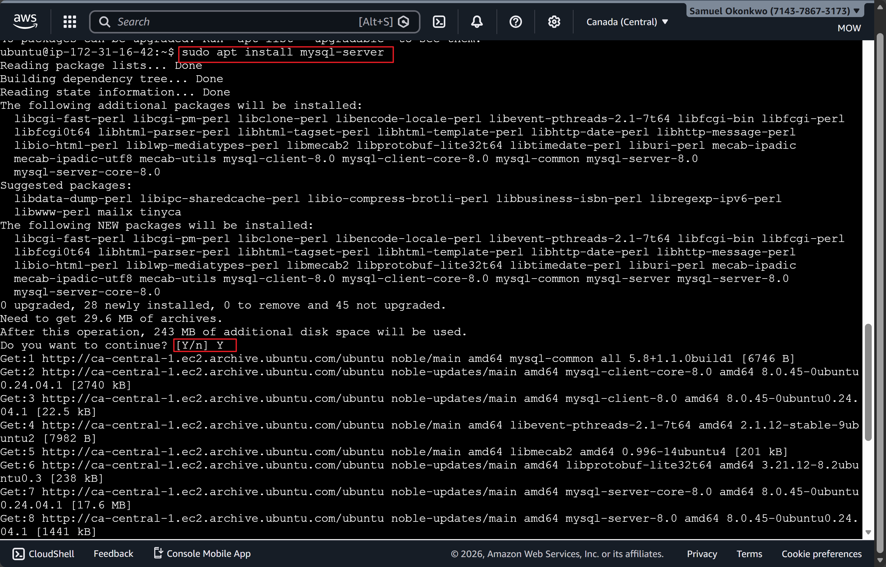

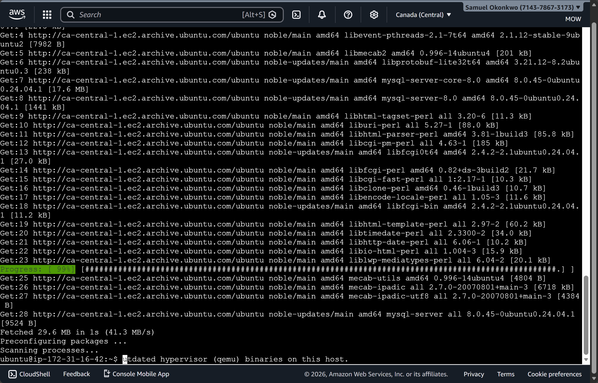

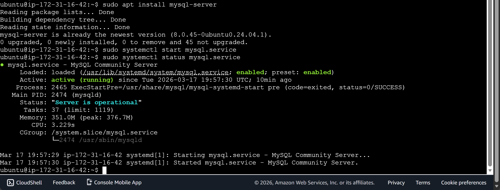

## SETTING IT UP
sudo mysql

For the password I'll be using 'Password'

ALTER USER 'root'@'localhost' IDENTIFIED WITH mysql_native_password BY 'PassWord.1';

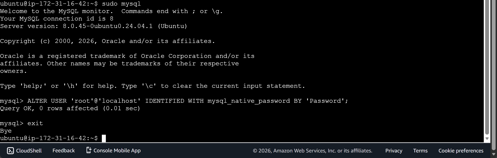

Run a MySQL secure installation

sudo mysql_secure_installation

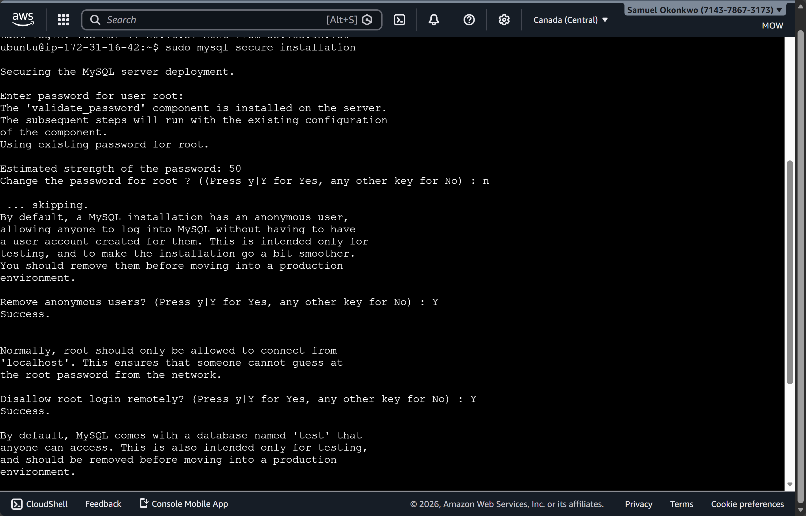

Answer Y for yes, or anything else to continue without enabling.

In the MySQL server create a user and a database named first_db and a user named first_user, but you can replace these names with different values.

First, connect to the MySQL console using the root account:

sudo mysql -p

Create a new database by running this command from your MySQL console:

CREATE DATABASE example_database;

Create a new user and grant full privileges on the database we have just created.

CREATE USER 'example_user'@'%' IDENTIFIED WITH mysql_native_password BY 'PassWord';

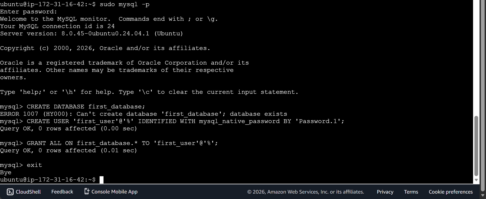

Note: This will give the example_user user full privileges over the example_database database, while preventing this user from creating or modifying other databases on your server.

Exit the MySQL shell with: exit

Test if the new user has the proper permissions by logging in to the MySQL console again, this time using the custom user credentials:

mysql -u example_user -p

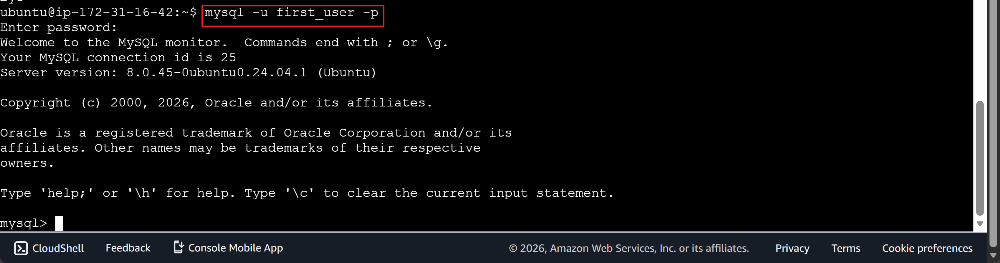

The -p flag in this command, which will prompt us for the password used when creating the example_user user.

After logging in to the MySQL console, confirm that you have access to the example_database database: mysql> SHOW DATABASES;

This will give you the following output:

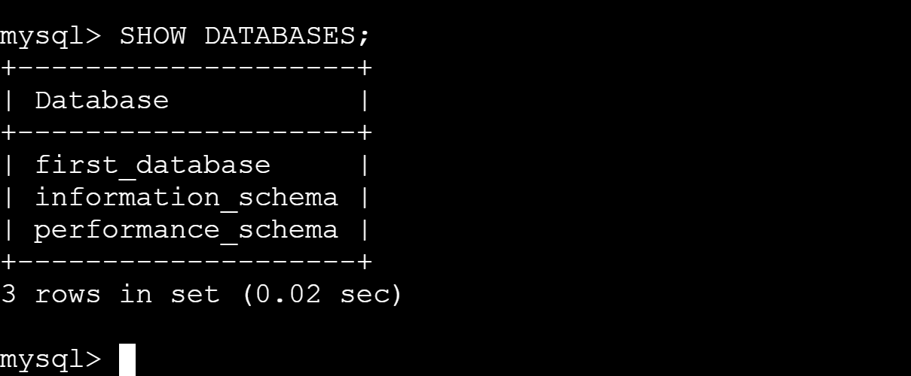

Exit MySQL and restart the mySQL service using

sudo systemctl restart mysql sudo systemctl status mysql.service

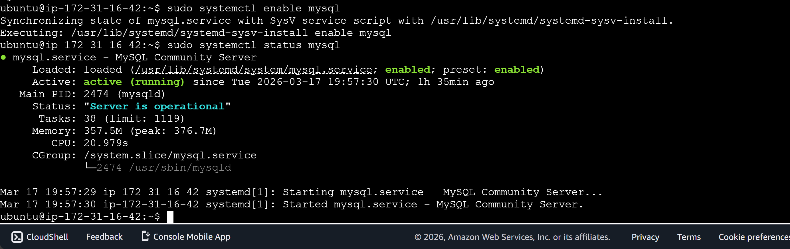

You might need to configure MySQL server to allow connections from remote hosts.

sudo nano /etc/mysql/mysql.conf.d/mysqld.cnf

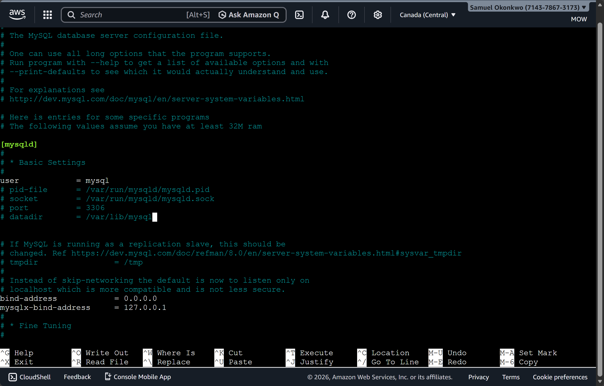

By default, both of your EC2 virtual servers are located in the same local virtual network, so they can communicate to each other using local IP addresses. Use mysql server's local IP address to connect from mysql client. MySQL server uses TCP port 3306 by default, so you will have to open it by creating a new entry in ‘Inbound rules’ in ‘mysql server’ Security Groups.

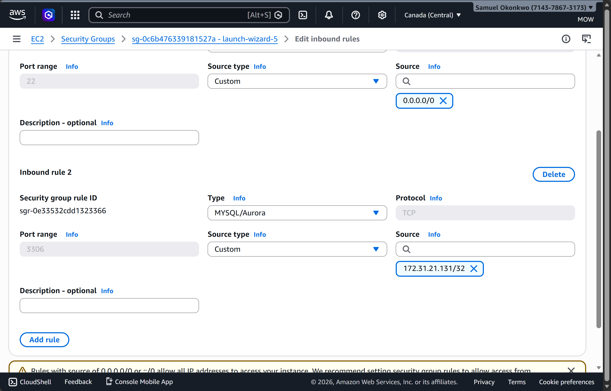

Mysql client private ip address is used above instead of 0.0.0.0 for extra Security

Save the above configurations.

## SET UP MYSQL CLIENT
ssh into mysql-client instance

On mysql client Linux Server install MySQL client software.

sudo apt update && sudo apt ugrade

install the mysql-client package: 

sudo apt install mysql-client -y

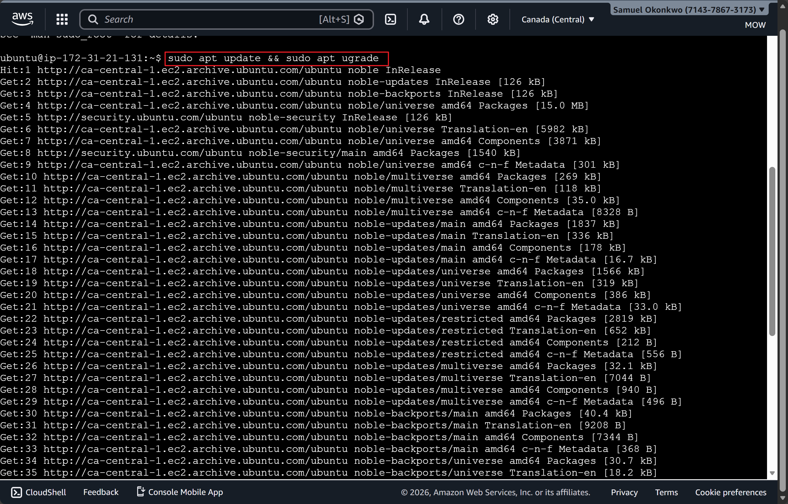

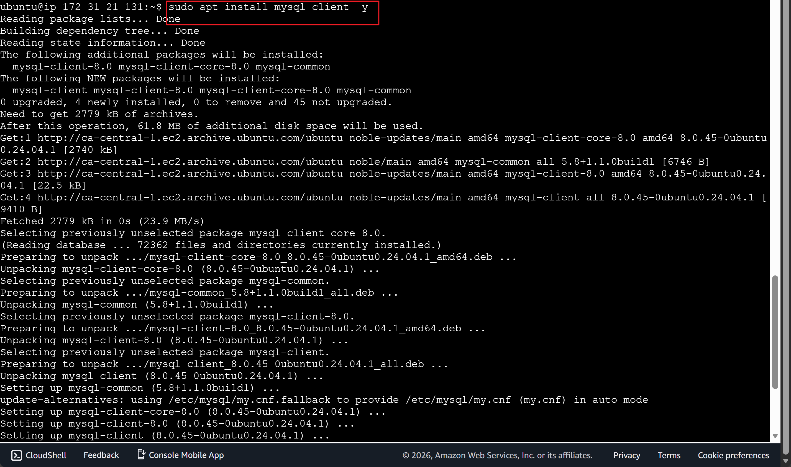

From mysql client instance connect remotely to mysql server Database using:

sudo mysql -u example_user -h <mysqlserver private ip> -p

Type this in and the database should be visible: show databases;

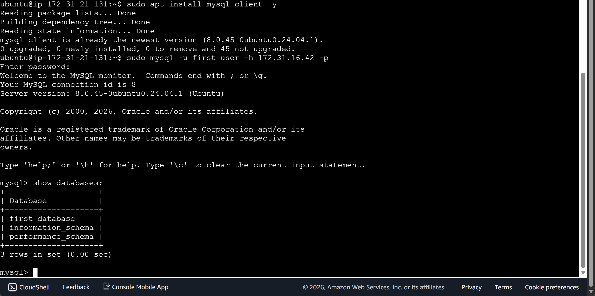